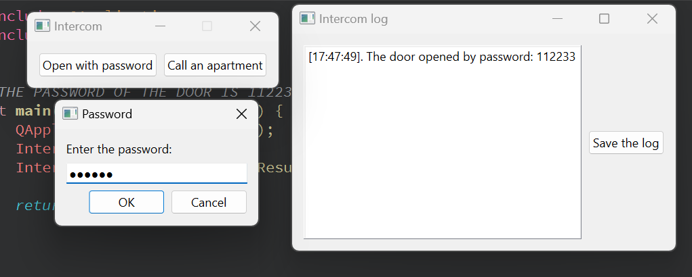
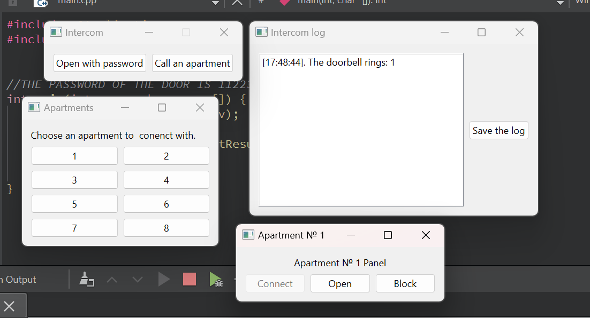

# Intercom System Simulation

This project is a **simulation** of an intercom system for a multi-apartment building, implemented using **C++** and the **Qt framework**. The system regulates access to the building's entrance, allowing residents and visitors to interact through an interface that mimics real-world intercom functionality. 

## Features

- **Apartment Access:**
  - Visitors can press a button corresponding to an apartment to initiate contact.
  - Residents can open the building door by entering password or respond to a visitor's call.
  
- **Resident Controls:**
  - **connect**: Establishes a connection between the resident and the visitor.
  - **Open**: Opens the building door.
  - **Block**: Temporarily disables the apartment from receiving calls.

- **Event Log:**
  - The system logs all actions, such as opening the door and visitor attempts to call apartments. Logs can be saved for later review.

## How It Works

1. **Visitor Interface:**
   - Visitors can attempt to open the door by entering password. If the password is incorrect, the event is logged.
   - Visitors can press a button on the panel to call an apartment. The resident receives the call and can interact using the controls.

2. **Resident Interface:**
   - When a call is received, the resident has the option to talk to the visitor, open the door, or block future calls.
   - Pressing the "Open" button opens the door and logs the event.
   - The "Block" button can disable calls from the panel until it is pressed again.

## Screenshots

### Main Interface

- The first screenshot shows the main intercom panel with option to **open the door with password**.
- The second screenshot shows the main intercom panel with option to **call an apartment**.

## Event Log

The log records all significant interactions, such as:
- Door opened with password.
- Visitor attempts to call an apartment.
- Actions taken by the resident (connect, open, block).

The logs can be saved by clicking the **Save Log** button.

